# BlackList
## Part I - Introduction to threads in JAVA
using Start:  
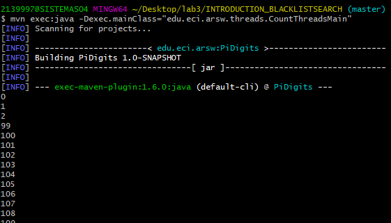
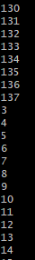
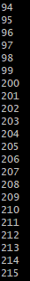  
using Run:  
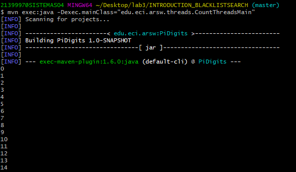
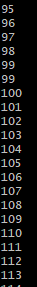
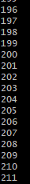  
as we notice when we use run it works secuentially so while Run on thread A is working Run on thread B and C can't start.
on the other hand when we use Start the Thread begin to work normally but he doesn´t block the other ones to start working so Thread B and C can start working
so as we notice on the pictures the threads overlaps.

## Part II - Black List Search Exercise 
the new file is checkSegment.java and we made some changes on HostBlackListValidator.java  
with those changes we can now check the databases with threads in order to improve the efficiency of 
the search so following we can see the results:  
 -we can notice that the program is notifying the number of blacklist checked:  
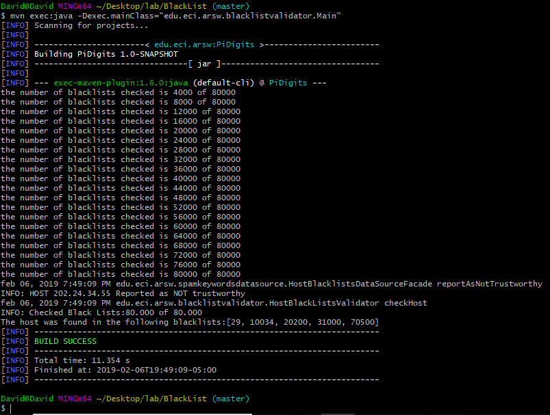   
- and now we can check if the project is giving correctly the results with the test IP adrresess given:  
 202.24.34.55(Blacklisted):  
 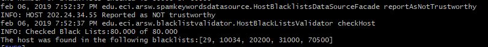  
 212.24.24.55(not Blacklisted):  
 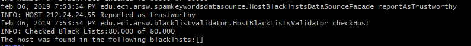  
 
## Part III - Discussion
The strategy of parallelism previously implemented is inefficient in certain cases, since the search is still carried out even when the N threads (as a whole) have already found the minimum number of occurrences required to report to the server as malicious. How could the implementation be modified to minimize the number of queries in these cases? What new element would this bring to the problem?  
to solve this we can use a variable wich works as a counter to know on how many blacklists is the host asked.  
when the counter reach the blacklist limit we can stop all threads and show that the host is not trustworthy.
the problem with this counter is that as each thread can modify it we can get a scenario where the data gets corrupted due to some operations of the threads.
to solve this we can use an atomic variable which allows each thread modify it without any problem as it is an atomic operation we cant get to the case that a thread operation overlaps another thread operation and corrupt the data.  
## Part IV - Performance Evaluation  

performance with 1 thread:  
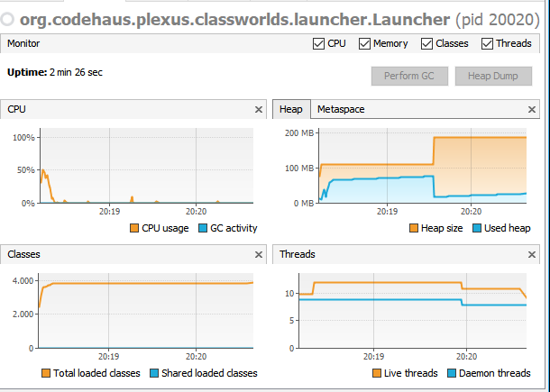  
  performance with the number of available cores :  
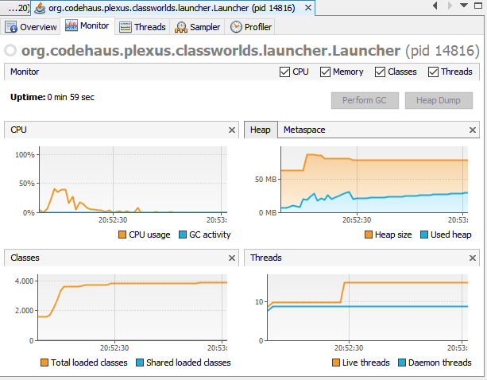  
  performance with twice number of available cores :   
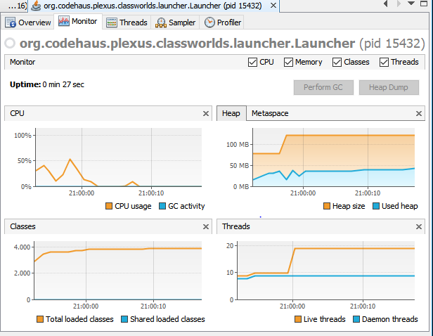  
  performance with 50 threads:  
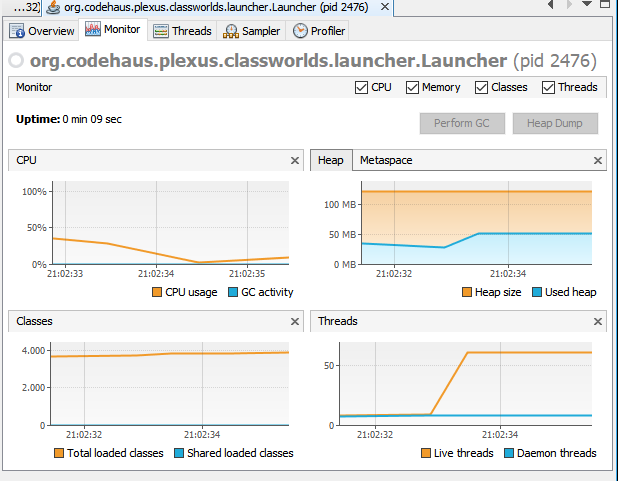  
  performance with 100 threads:  
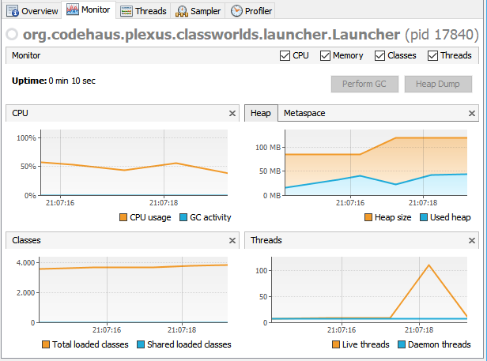  
  performance with 200 threads:  
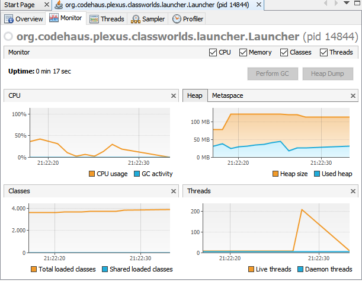  
  performance with 500 threads:  
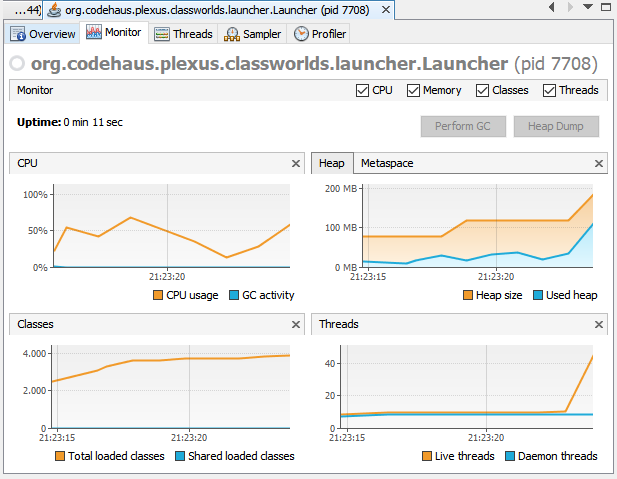  
  the following  graph represents the relation between the time and the number of threads:  
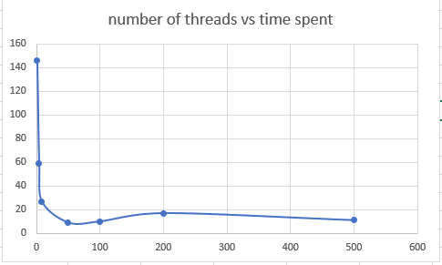  

### questions
1. because it gets to a point that using more threads start delaying the result instead of improving it, this is because each threads give more work to the processor so it gets slower in order to maintain such quantity of threads. with 500 threads is slighthy better than 200 threads but as we notice is not as good as with 50 threads wich is the lower point we get.
2. using threads twice as processors availables is better in this case than using the number of processors available  because the load is distributed better and each thread work on a segment in a very efficient way, but this is not always the case, in some case it may be better to use just the number of available cores.
3. yes it will be better because each core focus on just 1 thread, instead of making them sleeping for a while and then waking them up again, this have a very high cost in order of performance so as each core focus on one thread it have no reason to do that process that reduces the effectivity of the algorithm    

