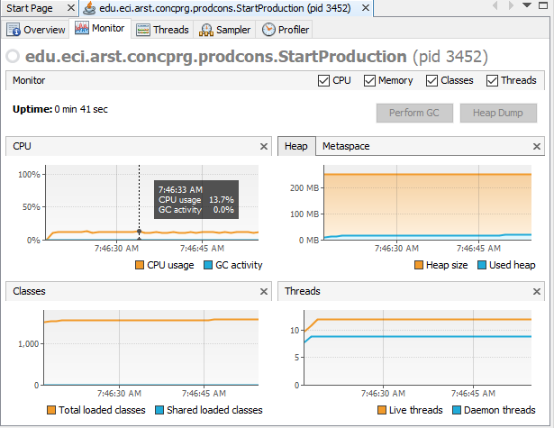
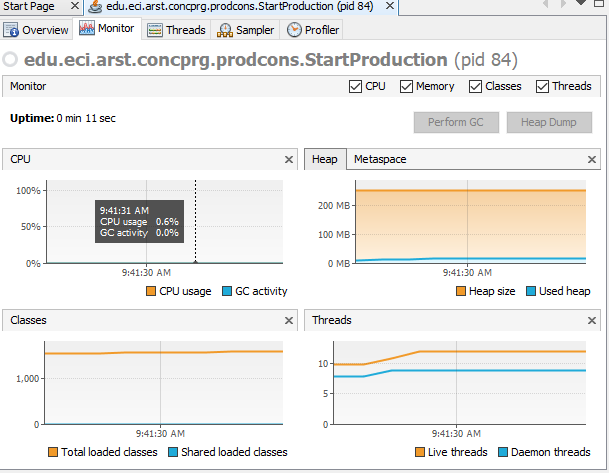

## part 1
1.  
  
the reason for this consumption is that all threads are active at every time even if they are not doing anything so this cause the processor to destine useful resources on a thread that dont need them, increasing the usage of the CPU.  
 the class responsable of this consumption is the consumer as he is  checking the queue at every time and not where it is an element available making an active process.
 
 2.  
 to solve this problem the consumer check if there is any product available to consume, if not he sleeps until the producer create a new product and notify the consumer in order that he consumes it, it also can be a consumer buffer in order to consume a greater amount of products instead of just one.  
 following is the result of the modification:
  
 