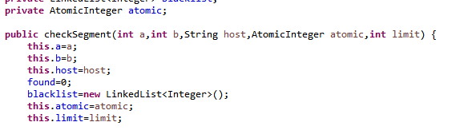

## part 1
1.  
the reason for this consumption is that all threads are active at every time even if they are not doing anything so this cause the processor to destine useful resources on a thread that dont need them, increasing the usage of the CPU.  
 the class responsable of this consumption is the consumer as he is  checking the queue at every time and not where it is an element available making an active process.  
  
2. to solve this problem the consumer check if there is any product available to consume, if not he sleeps until the producer create a new product and notify the consumer in order that he consumes it, it also can be a consumer buffer in order to consume a greater amount of products instead of just one.  
 following is the result of the modification:  
  
3. now we will work with a fast producer and a slow consumer and here are the results:  
  
as we notice the CPU usage is not high even with a stock limit of 3 so the process is working correctly and efficiently

## part 2
for the blacklist to work we have to do little modifications to the checkSegment and hostBlacklistValidator, first of all we declare
an atomic integer and give it to the threads, they also need to know the limit so we give them it too:  
hostBlackListValidator:    
  
checksegment:  
  
then when all threads hit the limit we stop each thread:  
  
and finally we test the program:  
      
  as we notice we dont need to check all blacklists to know that the host isn't trusty.

## part 3
2 as each inmortal has 100 points of life with N inmortals the amount of life points needs to be 100*N at every time of the execution.  
3  the invariant is not satisfied, as we notice the total  health when we pause the game is not always the same and in some times it grows and in other ones it decreases so we need to fix it.  
4 implementation of pause and check:  
   
 implementation of resume:  
    
    
 and with that, the  pause and check along with the resume buttons works correctly, now we will see that with a large amount of inmortals it works:  
     
    
and finally we implement the stop button:  

 